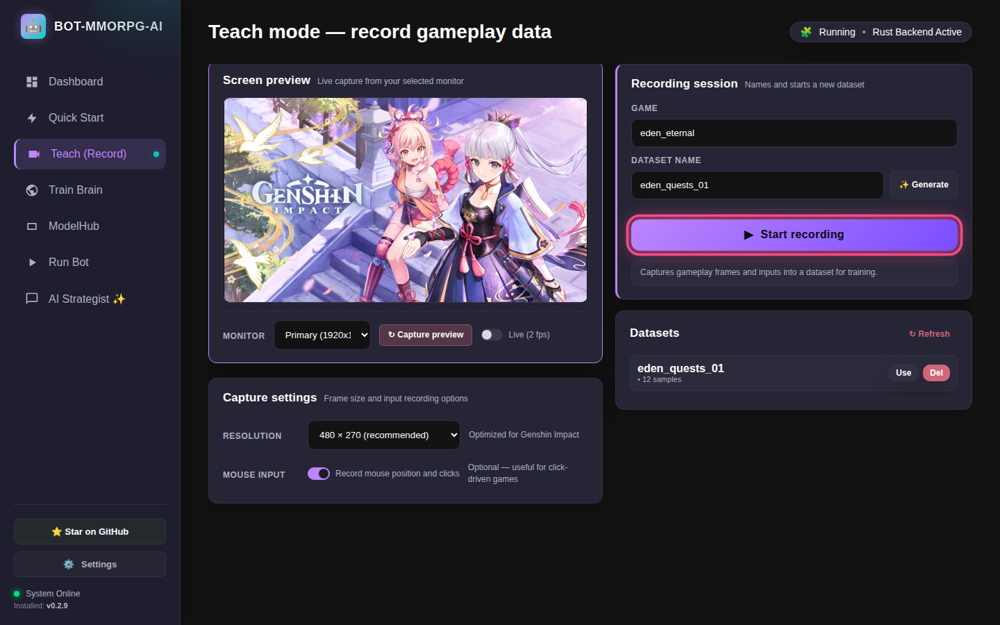
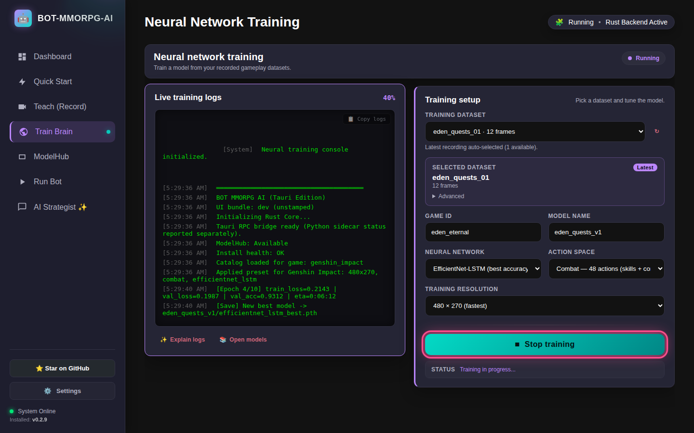
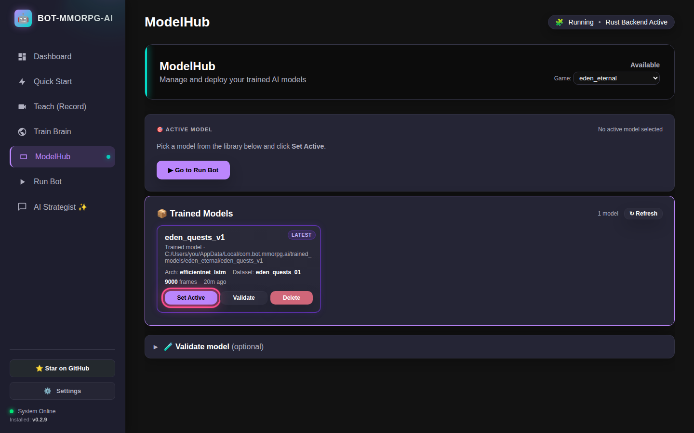
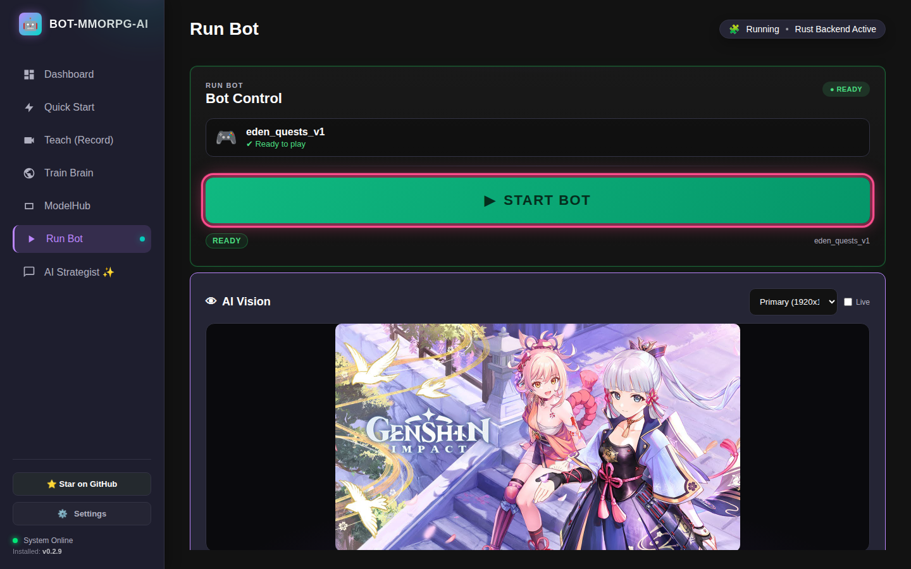
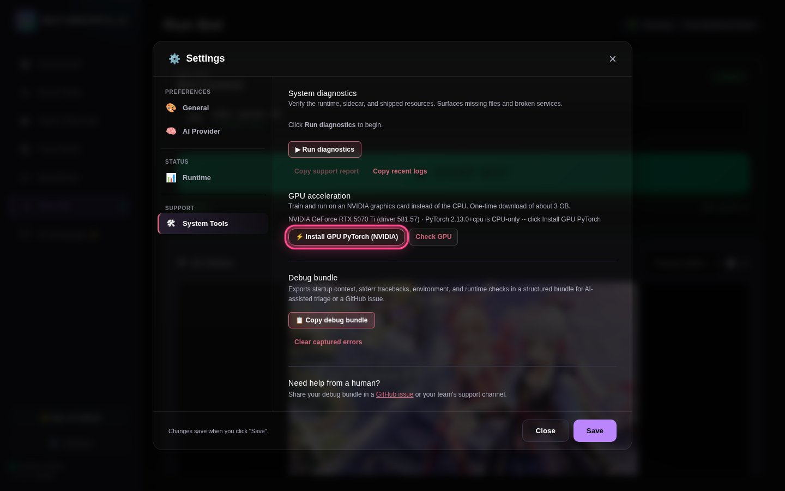

# 🎮 Play Once. Let the AI Grind Forever.

**You play for 15 minutes. The AI watches, learns, and keeps playing for you.**

No coding. No scripts. Just 4 clicks. 👇

---

## 1️⃣ Install

Download the `.exe` from **[Releases](https://github.com/ruslanmv/BOT-MMORPG-AI/releases)** → run it → done. ✅

---

## 2️⃣ Teach: play, it watches 👀

**Teach (Record)** → **Start recording** → play normally for 10–15 min → stop.

> 🖱️ Click-to-move game? Turn on **Record mouse position and clicks**.

---

## 3️⃣ Train: the AI learns 🧠

**Train Brain** → pick your recording → **Start training** → grab a snack 🍕

> ⏱️ Taking too long? Hit **Stop training** anytime. The best brain so far is saved.

---

## 4️⃣ Activate your brain 🎯

**ModelHub** → your new model → **Set Active**

---

## 5️⃣ Let it play 🚀

**Run Bot** → **START BOT** → switch to your game during the **3‑2‑1**.

**T** = pause ⏸️  **ESC** = quit 🛑

---

## 🟢 Got an NVIDIA card? Go way faster

**Settings → System Tools → ⚡ Install GPU PyTorch (NVIDIA)**. One click. Training drops from hours to minutes.

---

## 🔥 Pro Tips

- 🖥️ Play in **1920×1080**. Same screen = smarter bot.
- 🎯 **One thing per recording.** One quest or one farm route.
- ⏳ **More play = smarter bot.** 15 min is a start. 1 hour is a beast.

---

## 😵 Stuck? 10‑Second Fixes

| Problem | Fix |
|---|---|
| Training takes **forever** | **Stop training** → ModelHub → **Set Active**. Or get the ⚡ GPU boost |
| "Model missing on disk" | ModelHub → **Set Active** again |
| Preview is black / broken | Update to the latest release → **Capture preview** |
| Bot does nothing | Click into your game during the countdown. Mouse game? Record with mouse ON |
| Red warning at startup | Settings → System Tools → **Run diagnostics** |
| Still stuck? | **Copy support report** → paste in a [GitHub issue](https://github.com/ruslanmv/BOT-MMORPG-AI/issues) 🙏 |

---

## ❓ Quick Answers

**Which games?** Any PC game you control with keyboard, mouse or gamepad: Genshin, WoW, FFXIV, GW2, ESO, Eden Eternal, MapleStory… 🗡️

**Mobile games?** Only through a PC emulator window.

**Safe?** Many games ban bots. Check your game's rules. Use at your own risk. ⚠️

---

⭐ **Like it? Star the repo and share your farming clips!** ⭐
