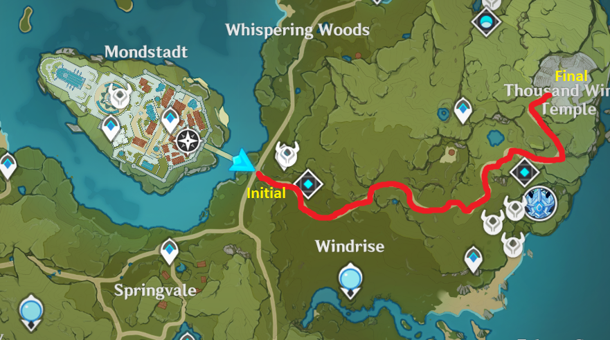
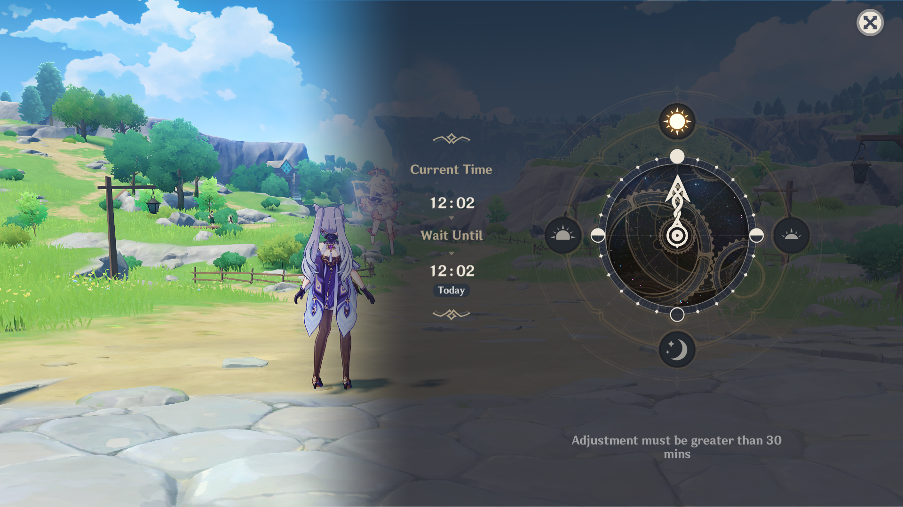

## How to create your own Bot with Artificial Intelligence that plays your favorites  RPG or MMORPG games

*Last revision March 2022*

Today I will try to explain how to create a program that will play your favorite **video games**. This is useful when you don't have time to farm and you need to kill moobs and get items. 

If you are interested in joining to this project, you are **welcome** to contribute. You can join to [slack here](https://join.slack.com/share/enQtMjg3MzM0OTY2MDMzNy04NDY5OGE2NzJiNTk4YzkyYjBlMDAyMzBiNzlkZTIyNzllOTA5MmQ5NDkzOTEyYmQ0MTgxZjAyNjM0MWM2NThl)

The **RPG** game that I will choose for this project is [Genshin Impact](https://genshin.mihoyo.com/en/)

but also this program should be compatible with  **New World** , **World of Warcraft**, **Guild Wars 2** ,**Final Fantasy XIV**, Elder **Scrolls Online** and so on.

Currently due to lack of time, just I will develop this interesting project on **Genshin Impact**, that can be used as a template to use to the remaining games.

The objective of the project is develop a 

**a) general neural network** that can be adapted to different videogames that can be useful to  automatize video games.

**b)** **develop the local/cloud infrastructure** that allows us record and process the data.

The cloud technologies that can be used in principle can be **AWS,** **Google Cloud** and  **Microsoft Azure**. We can try to test each of them.

We will start with  local development  and some free AWS microservices.

 **c) Enjoy coding and pass fun**, one of the important aspects of this project is to learn, enjoy and pass good moments with the **AI Community Gamer**.

## Tasks to perform

The first tasks that we want to perform are: 

Create a Neural Network that allow the following:

1. Auto exploration
2. Kill moobs in a Dungeon
3. Collect items.

## Task 1 Auto exploration

The first challenge that we want to perform is develop an **Neural Network** that allow us run from the Initial **Point A** until  final **Point B**

we will consider the initial  point **Mondstand** and the Final point **Thousand Wind Temple**

The time that we will choose is **12:00**

# How to run the BOT-MMORPG program

There are two different versions of the same program. 

**Type 1**- The **type blog**, via **Jupyter Notebook** in the format **.ipynb**

**Type 2**- The **type prod**, via **Python** by using **command Prompt.**

The **Type 1**, the non prod, is the self-explanatory program written in **Jupyter notebook.**   

 The reason to do that is familiarize with the code, and see the  logic the development. In this way anyone who is interested to understand why I have made the program in this way.

This help to newcomers introduce the code , and help find bugs. In addition allows write the code type blog.

The **Type 2** is the production program, written in simply python script, without discussions or extra things that are not needed to run the whole program. Here we skip all the analysis of the type 1 and just we  put everything a clean as a possible.

## Current Solution

The preliminary solution is given with the following parts:

1. **[Creation of the frontend application](./frontend/README.md)** - Here, we create a  python program that will record our gameplay and control our videogame.  The frontend application consists into 3 programs.

   a) Collection of Data - This program  record the screen during the gameplay. At this stage we focus with small amount of data. Later in the Part 2 we will allocate the data in the cloud.

   b) Creation of the Model - This program read the collected data and we create a neural network model

   c) Test the model - Here we load the created model and test in the gameplay.

    (**updated March 2022**).

   There is one program to record the gameplay and there is another that simulates the gameplay 

   **[Gameplay API programs](./frontend//input_record/README.md)** 

   

2. **Creation of the backend pipeline** . The extension of the frontend part consists to create a pipeline program that will move the recorded data into the cloud. This is important to record log periods of gameplay recording. Here we can use object storage like **s3** or **minio**. This allows us do not to saturate the **hard disk** on the client side during the **gameplay.** 

3. **Creation of the Dataset** - In this part, we  load the a dataset of the gameplay, that contains the screen images, the recorded  keys and gamepad. 

4. **Data wrangling** -We can improve our dataset by performing the augmentation procedure of the images. Here we need to apply good skills in computer vision.

5. **Model creation** - The first version of this bot will use Neural Networks. The framework used will be **Tensorflow** and **Pytorch**. Here we will create the brain of our bot.

6. **Training g Docker Container** - Creation o the Docker container environment with **JypyterLab** for this Bot project with all the training packages.

7. **Training of the model** - Here, we need to train the neural network. Here we may require a cluster. We can use the **Colab** to use the training with colab or pay a little to run a cluster on **EMR AWS** with a Container with all our environment ready.

8. **Creation of the frontend application that plays** - Here, we need to create a program that reads the game's screen and depends on what executes the **Artificial intelligence Model** you have made before.

For the development of the Neural Network we have two approaches:

The **first approach is** consider the  **preprocessed**  images, that means take the rgb images and the input into an array **(450, 480, 270, 3)** without processing the data and then use an **inception_v3** model with 29 ouputs.

The **second experimental** approach  consists to take  the images and filter them into unicolor, adapted to the path where the characters run, then append this unicolor image  with the input into an array **(450, 480, 270, 1)** and then use an **inception_v3** model with 29 ouputs. The motivation to use unicolor is just a manner to simplify the image such is explained in this [blog](https://ruslanmv.com/blog/How-to-use-OpenCV-with-Games) 

## How to use BOT-MMORPG

Currently, to use the latest version of this AI, you will need to run first 

[1-Collect_Data_Preprocessed-rgb.ipynb](./versions/0.01/1-Collect_Data_Preprocessed-rgb.ipynb)

or

[1-collect_data.py](./versions/0.01/1-collect_data.py)

When creating training data, this works when you have the game, in fullscreen mode, 1980x1080 resolution.

You need this for both training and testing.

(An experimental test was apply certain filters like those presented [here](https://github.com/ruslanmv/BOT-MMORPG-AI/blob/master/versions/0.01/0-Way-Identification.ipynb) and then [1-Collect_Data_Processed_single_color](./versions/0.01/1-Collect_Data_Processed_single_color.ipynb)  )

Next, Train the model . With the preprocessed data we will consider the  **inception_v3**  model.

[2-train_model_preprocessed.ipynb](./versions/0.01/2-train_model_preprocessed.ipynb)

or

[2-train_model.py](./versions/0.01/2-train_model.py)

Finally, we test our  model in game with 

[3-test_model.ipynb](./versions/0.01/3-test_model.ipynb) 

or

[3-test_model.py](./versions/0.01/3-test_model.py) 

### Note developments:

Currently we are using the  **Inception_v3**  model, but we are interested to perform transform learning from the following models:

| Model                                                        | Size (MB) | Top-1 Accuracy | Top-5 Accuracy | Parameters | Depth | Time (ms) per inference step (CPU) | Time (ms) per inference step (GPU) |
| ------------------------------------------------------------ | --------- | -------------- | -------------- | ---------- | ----- | ---------------------------------- | ---------------------------------- |
| [Xception](https://keras.io/api/applications/xception)       | 88        | 79.0%          | 94.5%          | 22.9M      | 81    | 109.4                              | 8.1                                |
| [VGG16](https://keras.io/api/applications/vgg/#vgg16-function) | 528       | 71.3%          | 90.1%          | 138.4M     | 16    | 69.5                               | 4.2                                |
| [VGG19](https://keras.io/api/applications/vgg/#vgg19-function) | 549       | 71.3%          | 90.0%          | 143.7M     | 19    | 84.8                               | 4.4                                |
| [ResNet50](https://keras.io/api/applications/resnet/#resnet50-function) | 98        | 74.9%          | 92.1%          | 25.6M      | 107   | 58.2                               | 4.6                                |
| [ResNet50V2](https://keras.io/api/applications/resnet/#resnet50v2-function) | 98        | 76.0%          | 93.0%          | 25.6M      | 103   | 45.6                               | 4.4                                |
| [ResNet101](https://keras.io/api/applications/resnet/#resnet101-function) | 171       | 76.4%          | 92.8%          | 44.7M      | 209   | 89.6                               | 5.2                                |
| [ResNet101V2](https://keras.io/api/applications/resnet/#resnet101v2-function) | 171       | 77.2%          | 93.8%          | 44.7M      | 205   | 72.7                               | 5.4                                |
| [ResNet152](https://keras.io/api/applications/resnet/#resnet152-function) | 232       | 76.6%          | 93.1%          | 60.4M      | 311   | 127.4                              | 6.5                                |
| [ResNet152V2](https://keras.io/api/applications/resnet/#resnet152v2-function) | 232       | 78.0%          | 94.2%          | 60.4M      | 307   | 107.5                              | 6.6                                |
| [InceptionV3](https://keras.io/api/applications/inceptionv3) | 92        | 77.9%          | 93.7%          | 23.9M      | 189   | 42.2                               | 6.9                                |
| [InceptionResNetV2](https://keras.io/api/applications/inceptionresnetv2) | 215       | 80.3%          | 95.3%          | 55.9M      | 449   | 130.2                              | 10.0                               |
| [MobileNet](https://keras.io/api/applications/mobilenet)     | 16        | 70.4%          | 89.5%          | 4.3M       | 55    | 22.6                               | 3.4                                |
| [MobileNetV2](https://keras.io/api/applications/mobilenet/#mobilenetv2-function) | 14        | 71.3%          | 90.1%          | 3.5M       | 105   | 25.9                               | 3.8                                |

And identify  the behavior  with our train and test dataset.

## Acknowledgments

* Everyone at the [gamePyd](https://github.com/4amVim/gamePyd) proyect
* Everyone at [vJoy](http://vjoystick.sourceforge.net/site/) for the vXboxInterface DLL
* [nefarius](https://github.com/nefarius) for [ScpVBus](https://github.com/nefarius/ScpVBus)
* See also the list of [contributors](https://github.com/bayangan1991/PYXInput/graphs/contributors) who participated in PYXinput 
* This project  it is possible thank you the previous projects
  [Self-Driving-Car-with-Neural-Networks](https://ruslanmv.com/blog/Self-Driving-Car-with-Neural-Networks) 
* Everyone at [PyGTA5](https://github.com/Sentdex/pygta5) project

## Contributing

Please free  to contribute following the standard guidelines for submitting patches and additions or solutions. Feel free to submit issues and enhancement requests.

To more information visit [ruslanmv.com](https://ruslanmv.com/).

Copyright 2021 Ruslan Magana Vsevolodovna <contactATruslanmvDOTcom>
This program is distributed under the terms of the GNU Lesser General Public License.

