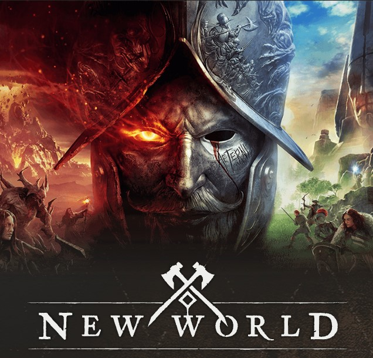

## How to create your own Bot with Artificial Intelligence that plays your favorite MMORPG

Today I will try to explain how to create a program that will play your favorite **MMORPG**. This is useful when you don't have time to farm and you need to kill moobs and get items. 

If you are interested in joining to this project, you are **welcome** to contribute

The **MMORPG** that I will choose for this project is [NewWorld](https://www.newworld.com/en-us/):

but also this program should be compatible with  **World of Warcraft**, **Genshin Impact**, **Guild Wars 2** ,**Final Fantasy XIV**, Elder **Scrolls Online** and so on.

The preliminary solution is given with the following parts:

1. **Creation of the frontend application** - Here, we need to create the python program that will record our gameplay and control our videogame. This program should be able to record the screen during the gameplay.
2. **Creation of the backend pipeline-** Here, we need to create a pipeline program that will move the recorded data into the cloud. Here we can use object storage like s3 or minio. This allows us do not to saturate the **hard disk** on the client side during the **gameplay.** 
3. **Creation of the Dataset** - In this part, we have to create a dataset of the gameplay, recording the keys and mouse position and the screen. The recorded dataset may be stored in a non-relational database.
4. **Data wrangling** -This part, we have to augment the images correctly to create the appropriate machine learning model. Here we need to apply good skills in computer vision.
5. **Model creation**- The first version of this bot will use Neural Networks. The framework used will be **Tensorflow** and **Pytorch**. Here we will create the brain of our bot.
6. **Training g Docker Container** -Creation o the Docker container environment with **JypyterLab** for this Bot project with all the training packages.
7. **Training of the model** - Here, we need to train the neural network. Here we may require a cluster. We can use the **Colab** to use the training with colab or pay a little to run a cluster on **EMR AWS** with a Container with all our environment ready.
8. **Creation of the frontend application that plays** - Here, we need to create a program that reads the game's screen and depends on what executes the Artificial intelligence Model you have made before.

## Contributing

Please free  to contribute following the standard guidelines for submitting patches and additions or solutions. Feel free to submit issues and enhancement requests.

To more information visit [ruslanmv.com](https://ruslanmv.com/).

