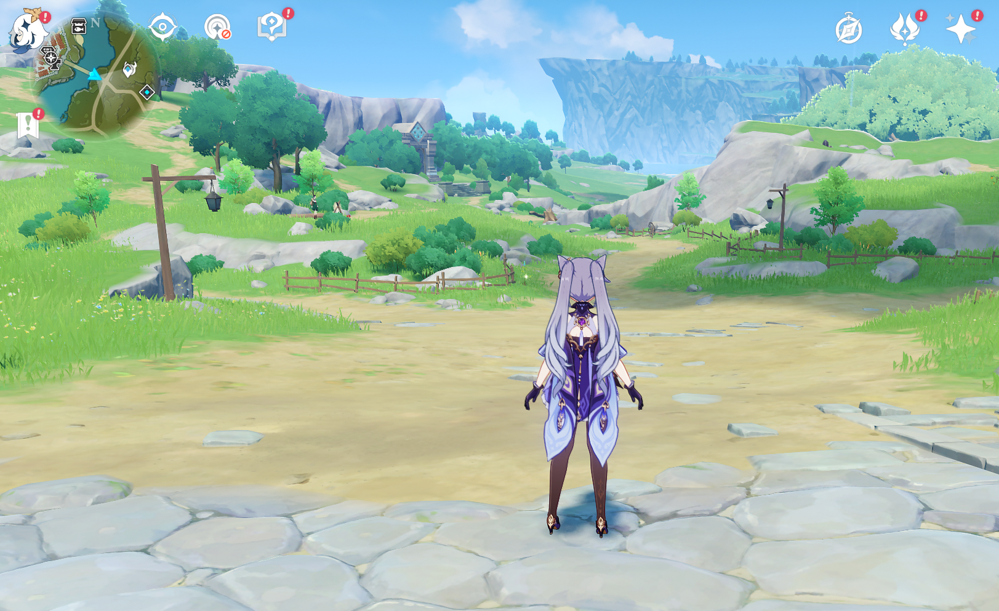
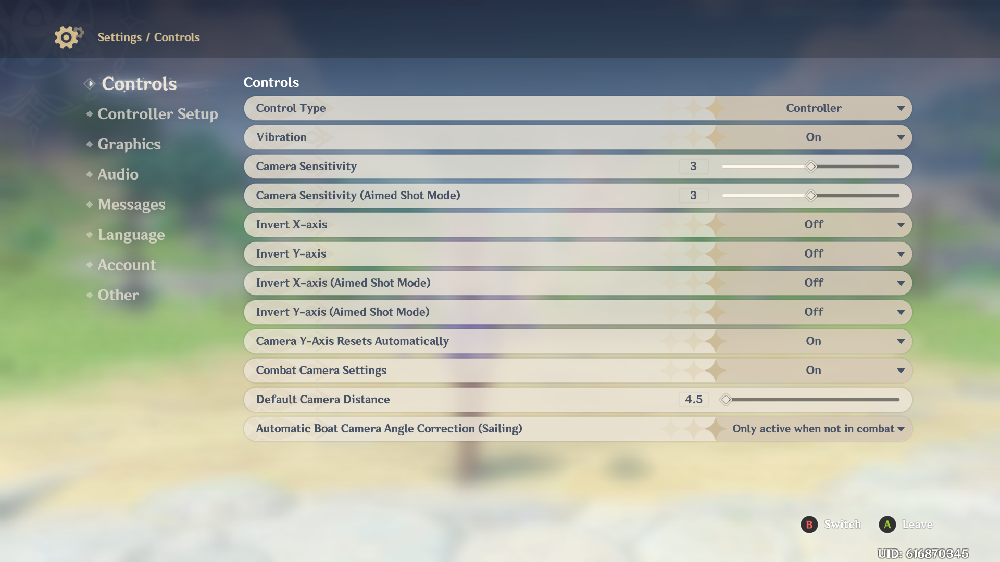
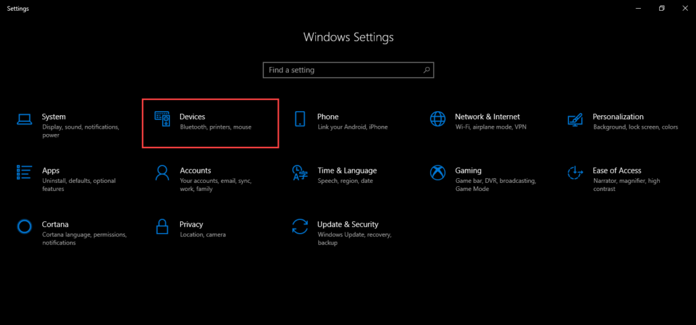
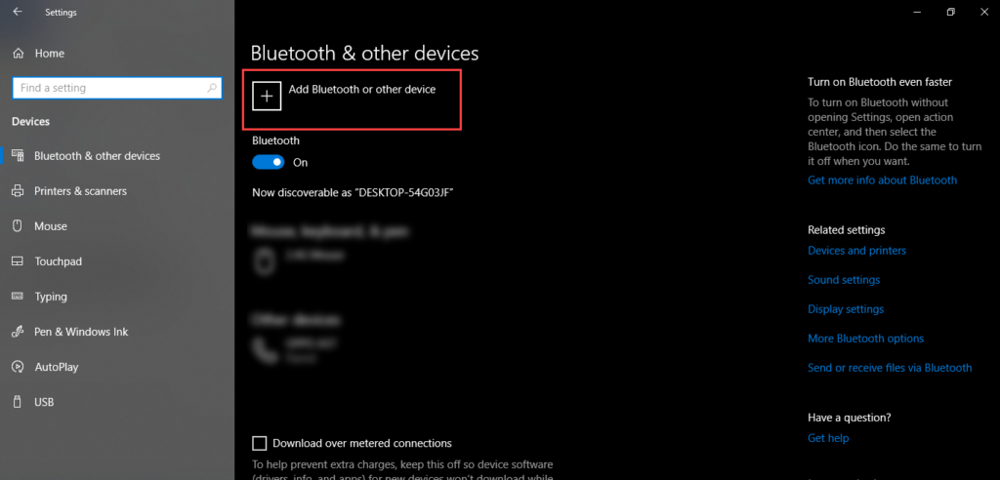
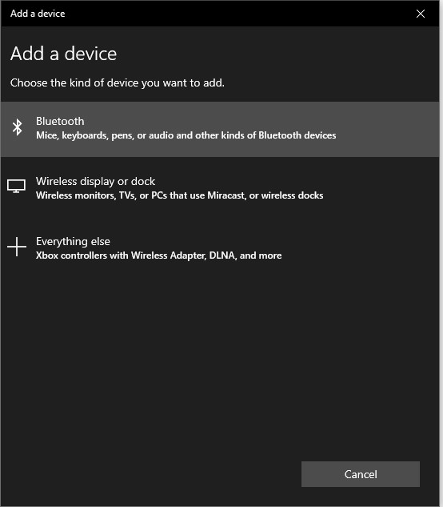
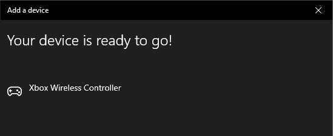

## Frontend - Gameplay  Record

Here we are going to create a program that will record the the keyboard and mouse and screen during your gameplay.

The **frontend layer** of this project is one of **hardest** part due to the **anticheat security system** of the games.  So the methodology chosen should be the most simple possible and undetectable, I know is not quite easy to afford that but in general always there are ways to achieve that.

## Frontend Design 

The frontend part consists basically intro three layers.


**Layer 0** is the layer where the player start playing the videogame.

**Layer 1**. In this part we  generate the data.

It consists into two parts.

a) By  recording the **keyboard** + **gamepad** during the **gameplay** in PC. The current project does not support mobile games at the moment. 

b) By recording the **gameplay screen**.

Also this layer includes the merge of both sources of data into a single formated dataset that is already formated ready to use.

**Layer 2**. We should incorporate a mechanims that ingest the temporal data into a  datalake.

We wont use any commercial program to solve this problem. We want to use a **free** , **open source** program that anyone can **read** ,**modify** and **improve**.


# Design of the Solution for Task 1

For the Task 1, we are going to consider Mondstand as the Initial Point and Thousand Wind Temple the Final Point.



The first **dataset** that we are going to create  will record only the **gamepad**. For this project we will consider a simple **xbox one** controller, attached to the game.




## Prerequisites

This library should work with anything after Python 3.6, albeit testing has only been done on 3.8.4 and later. Currently the only supported OS is Windows 10.

To use the Virtual Controller object, you need `ScpVBus`. For ease [one of it's versions](https://github.com/shauleiz/vXboxInterface) is included in this project. More information about the original can be found at [nefarius's archived repo](https://github.com/nefarius/ScpVBus).
You'll probably also require [x360ce](https://www.x360ce.com/#Help_Old_Version) for easing the connection to games as well as debugging it. I've included it's older version as that's the one that worked for me. 

##  Connect xbox controller to Windows 10

To connect any xbox  game controller to Windows 10, follow this procedure step by step:

Click the **Search** button, type **Settings** in the search bar. 

The **Windows Settings** screen will open. Select **Devices** option as follows:



As you will select the **Devices** option, the following screen will appear:



Select **Add Bluetooth or other device** option as the above image is showing. As you will select this option, the following dialogue will appear:



Select the **Bluetooh** option as above image is showing. It will display the connected **Game Controller**, select that and click **Done** button.

### Installing ScpVbus

We need ScpVBus to talk to Windows about gamepad related details:
Open an elevated cmd command prompt in the ScpVBus-x64 directory and run `devcon.exe install ScpVBus.inf Root\ScpVBus`. Successful run is indicated by the following message:

    Device node created. Install is complete when drivers are installed...
    Updating drivers for Root\ScpVBus from {Location}\PYXInput\ScpVBus-x64\ScpVBus.inf.
    Drivers installed successfully.

After you have installed your **Driver**, connect yuo xbox driver, you can open the program at`versions\0.01\vXboxInterface-x64\SCPUser.exe` and you will see


## Layer 1: Generation of Data 

### Keyboard/ Gamepad/ Mouse Recording

The keybord and mouse recording will be given by one python script 

The version v01 of this program will consider only the Keyboard and Gamepad.

For future release we can use

**[Keyboard and Mouse recording](./input_record/README.md)** 

### Video Recording

The screen vide recording will be given by one python script 

**[Screen video_recording](./video_record/README.md)** 

## Environment setup


We will use a python language as a base to develop the **first layer** of the generation of the data.

The **second layer** should be the ingestion to the **datalake**.


For the local enviroment we  need to install anaconda at this [link](https://www.anaconda.com/products/individual)


then in the command prompt terminal we type

```
conda create -n game   python==3.7 findspark tensorflow pytorch jupyterlab
```

I will use **Tensorflow** + **Pytorch** + **Spark** as the  main frameworks for future work, and this time I will use JupyterLab 

```
conda game activate
```

then in your terminal type the following commands:

```
conda install ipykernel
python -m ipykernel install --user --name game --display-name "Python (game)"
```

Installing libraries needed for the frontend

```
pip install pynput numpy pyautogui opencv-python
```

then open the jupyterlab with the command

```
jupyter lab
```


## Requirements of the images gameplay (v.01)

The pictures of the gameplay should satisfy the following requirements:

Dimensions: **320x160**, 

Width: **320 pixels**

Height **160 pixels**

Horizontal resolution:**96dpi**

Vertical resolution: **96 dpi**

Bith depth: **24**

Format: **JPG**

The screenshots should be saved in the directory **IMG**, for example:

C:\IMG\gameplay_2021_10_17_12_15_37_666.jpg

C:\IMG\gameplay_2021_10_17_12_15_37_771.jpg

 C:\IMG\gameplay_2021_10_17_12_15_37_876.jpg

.

.

.

C:\IMG\right_2021_10_17_12_15_45_810.jpg

**Controls** for Genshin Impact covers information on input methods supported by the game and used to control the player character as well as navigate menus and user interfaces. 


## Controls Registration

### PC Key Bindings

We are going to use the default key bindings for the standard Keyboard + Mouse controls. 

The first  aim of this program is register only the **navigation** and  **combat**  during the gameplay. 

For optimal use of this program, the gameplay resolution should be  1920x 1080, 4k resolution currently is not supported.

## Considered controls in the registration

### Controls

- Move Forward : W
- Move Backward : S
- Move Left : A
- Move Right : D
- Normal Attack : Left Mouse Button
- Elemental Skill : E
- Sprint : Left Shift / Right Mouse Button
- Jump : Space
- Elemental Burst : Q
- Pick Up / Interact : F


## Not considered

The following controls are not considered in the current version of the registration:

- Inventory : B
- Open Character Screen : C
- Map : M
- Open Wish Screen : F3

- Open Adventurer Handbook Screen : F1

- Paimon Menu : Esc

- Open Quest Menu : J

- Navigation : V

- Open Notification Details : Y

- Co-Op Screen : F2

- Chat Screen : Enter

- Open Domain Screen : U

- Elemental Sight (Hold) : Mouse Wheel Button

- Switch to Party Member

  


- Switch Aiming Mode : R
- Switch Walk / Run : Left Ctrl
- Check Tutorial Details : G
- Open the Events Menu : F5
- Open Battle Pass Screen : F4
- Challenge Interrupted : P

### Requirements of the gaming_log.csv (v.01)

The log file  should be saved in the directory **LOG**:

Each row of the dataset should include

For example  when during the registration the character is **AFK** (away from keyboard)  the **.csv** file should have the following data:


C:\IMG\gameplay_2021_10_17_12_15_37_666.jpg, 0,0,0,0,0,0,0,0,0,0,0,0,0,0,0

C:\IMG\gameplay_2021_10_17_12_15_37_771.jpg,  0,0,0,0,0,0,0,0,0,0,0,0,0,0,0

 C:\IMG\gameplay_2021_10_17_12_15_37_876.jpg, 0,0,0,0,0,0,0,0,0,0,0,0,0,0,0

.

.

.

C:\IMG\right_2021_10_17_12_15_45_810.jpg,   0,0,0,0,0,0,0,0,0,0,0,0,0,0,0


