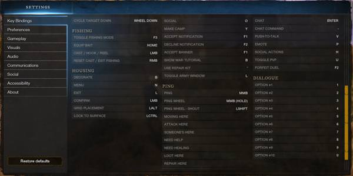

## 1.  Frontend - Gameplay  Record

Here we are going to create a program that will record the the keyboard and mouse and screen during your gameplay.

First we will need create a new environment to perform our program.

First you need to install anaconda at this [link](https://www.anaconda.com/products/individual)


then in the command prompt terminal we type

```
conda create -n game   python==3.7 findspark tensorflow pytorch jupyterlab
```

I will use **Tensorflow** + **Pytorch** + **Spark** as the  main frameworks for future work, and this time I will use JupyterLab 

```
conda game activate
```

then in your terminal type the following commands:

```
conda install ipykernel
python -m ipykernel install --user --name game --display-name "Python (game)"
```


Installing libraries needed for the frontend

```
pip install pynput numpy pyautogui opencv-python
```

then open the jupyterlab with the command

```
jupyter lab
```


## Requirements of the images gameplay (v.01)

The pictures of the gameplay should be  with the following requirements;


Dimensions: **320x160**, 

Width: **320 pixels**

Height **160 pixels**

Horizontal resolution:**96dpi**

Vertical resolution: **96 dpi**

Bith depth: **24**

Format: **JPG**


The screenshots should be saved in the directory **IMG**, for example:

C:\IMG\gameplay_2021_10_17_12_15_37_666.jpg

C:\IMG\gameplay_2021_10_17_12_15_37_771.jpg

 C:\IMG\gameplay_2021_10_17_12_15_37_876.jpg

.

.

.

C:\IMG\right_2021_10_17_12_15_45_810.jpg


**Controls** for **[New World](https://newworld.wiki.fextralife.com/New+World+Wiki)** covers information on input methods supported by the game and used to control the player character as well as navigate menus and user interfaces. 


For the logging 


##  New World Controls 

### PC Key Bindings

The following are the default key bindings for the standard Keyboard + Mouse controls. 


The first  aim of this program is register only the navigation and the **combat**+**navigation**


## Not considered

The following controls are not considered in the current version of the registration

### Camera

**Zoom In:** Mouse Wheel Up

**Zoom Out:** Mouse Wheel Down

**Camera Zoom Modifier:** N/A

**Free Look:** Alt

**Hide UI:** Left Alt + H

### User Interface

**Inventory:** TAB

**Map:** M

**Character:** K

**Journal:** J

**Company UI:** G

**Social:** O

**Scoreboard:** N

**Make Camp:** Y

### Social

**Chat:** Enter

**Chat Command:** /

**Push-to-Talk:** V (Hold)

### Action

**Cycle Weapon Up:** Mouse Wheel Up

**Cycle Weapon Down:** Mouse Wheel Down

**Cycle Weapon Modifier:** LEFT Alt

**Weapon #1:** 1

**Weapon #2:** 2

**Weapon #3:** 3

**Consumable #1:** 4

**Consumable #2:** 5

**Consumable #3:** 6

**Consumable #4:** 7

**Weapon Ability 1:** End

**Weapon Ability 2:** Page Down

**Weapon Ability 3:** Insert

**Interact:** Home

**Secondary Interact:** T

**Give Up:** Home


## Considered

### Melee Combat

**Light Attack:** Left Mouse Button

**Heavy Attack:** Hold left mouse button

**Block:** Right Mouse Button

**Roll/Dodge:** LShift

**Sheathe:** x

### Ranged Combat

**Shoot:** Left Mouse Button

**Aim:** Right Mouse Button (Hold)

**Reload****:** R

### Navigation

**Move Forward:** W

**Move Backwards:** S

**Move Left:** A

**Move Right:** D

**Sprint/Step Up:** Shift

**Auto-Run:** '

**Crouch Toggle:** '**C**

**Prone Toggle:** Z

**Walk:** Left CTRL (Hold)

**Jump**: Space

**Mantle:** Space + W

 

###  New World Keyboard and Mouse Control Options

[](https://newworld.wiki.fextralife.com/file/New-World/controls-new-world-wiki-guide-option-a.jpg?v=1632833811973)[](https://newworld.wiki.fextralife.com/file/New-World/controls-new-world-wiki-guide-option-b.jpg?v=1632833821311)


### Combat

LeftMouseButton,Holdleftmousebutton,RightMouseButton,LShift,x,R

### Navigation

W, S,A,D,Shift,Z,LeftCTRL ,Space

### Requirements of the gaming_log.csv (v.01)

The log file  should be saved in the directory **LOG**:

Each row of the dataset should include

#column :      1                    2   3   4      5     6                 7             8                                    9                                     10                     11      12  13

column:   datetime+.jpg , W, S,A,D,Shift,Z,LeftCTRL ,Space,LeftMouseButton,Holdleftmousebutton,RightMouseButton,LShift, x  ,R


For example of the csv when  is **AFK**


C:\IMG\gameplay_2021_10_17_12_15_37_666.jpg, 0,0,0,0,0,0,0,0,0,0,0,0,0

 C:\IMG\gameplay_2021_10_17_12_15_37_771.jpg,  0,0,0,0,0,0,0,0,0,0,0,0,0

 C:\IMG\gameplay_2021_10_17_12_15_37_876.jpg, 0,0,0,0,0,0,0,0,0,0,0,0,0

.

.

.

C:\IMG\right_2021_10_17_12_15_45_810.jpg,  0,0,0,0,0,0,0,0,0,0,0,0,0
