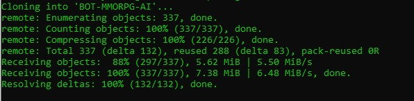

## Keyboard and Mouse Recording
For this project I will use AutoHotPy, it is a scripting tool, just like AutoHotKey, but it uses Interception library (https://github.com/oblitum/Interception).
The great thing is that Interception uses a very low level driver to capture keyboard and mouse events, which makes it perfect for games that have problems with AutoHotKey

## Installation
AutoHotPy doesn't really need any. You just place the scripts in the same folder and they just work. However, the libraries needed for it to run are not installed by default in any operative system.

1. Verify you have Python installed

2. Install git for Windows [here](https://git-scm.com/download/win)

3. Run your terminal as administrator

4. Download the interception Driver 

   ```
   git clone https://github.com/ruslanmv/BOT-MMORPG-AI.git
   ```

   

   ```
   cd "BOT-MMORPG-AI\frontend\input_record\Interception\command line installer"
   ```

5. Install interception driver (and restart your computer): http://oblita.com/Interception.html

   ```
   install-interception.exe /install
   ```

   hint: if double clicking in the executable doesn't install the driver (you will see an error message when you start AutoHotPy), try running a command line as administrator from the windows menu (right clicking on the program and selecting "Run as administrator"), and then go to your download location from the command line and run "install-interception.exe /install"

6. Place the .dll in the same place were you downloaded AutoHotPy. We need interception.dll to work!

   In our case the .dll is already in `BOT-MMORPG-WITH-AI\frontend\input_record`


To use AutoHotPy you only have to write a script and place it in the same folder where you installed the app.


## Running the scripts

To run any of the scripts open a command line and run 

```
python macro.py
```

```
---- Hello to Macro----
Press F1 to start/stop macro
Press F2 to start macro
Press F3 to save macro
Press F4 to clear macro
Press ESC to exit
----------

waiting key
F1 - startStopMacro
F1 - startStopMacro
F2 - fireMacro
F3 - saveMacro
ESC - exitAutoHotKey
```


With F1 you will start recording your macro, and with   F1 again you will stop the macro record.

with F2 you start the macro that in in memory.

With F3  you save your macro into a python file 'recorded_macro.py'


## TO DO
Extract the relevant information from the recorded_macro.py and  save it into a dataset of keyboard and  mouse dataset.


### Known bugs:

* the script crashes after saving a macro to a file and then trying to run the macro again. Workaround: restart the application after saving a macro to a file.


