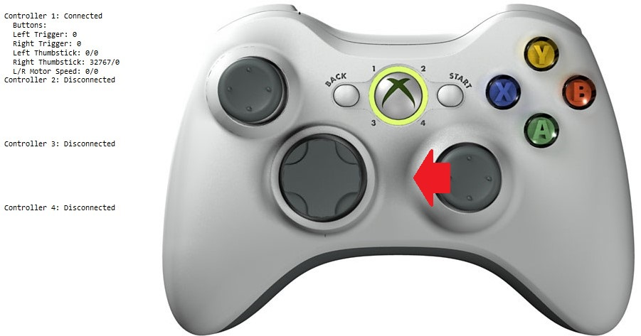
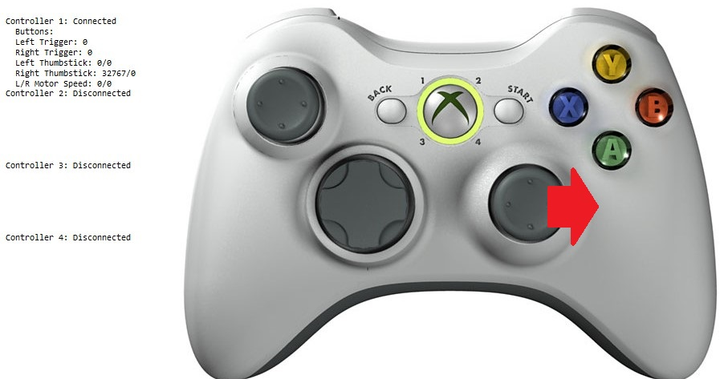
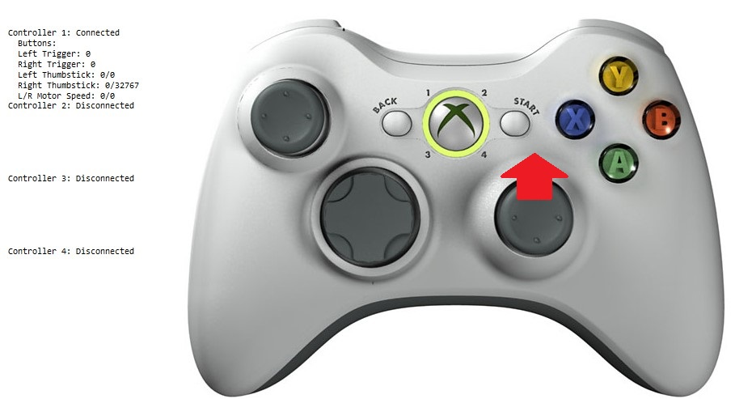
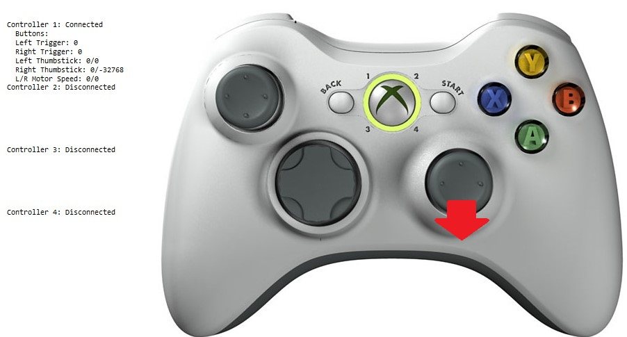

# vjoy-gamepad

vjoy is a module that emulates a generic controller.  Combine this with x360ce, which takes your generic controller and makes it emulate an xbox360 controller, and voila, you have xbox 360 controller emulation. 

I've actually employed this in game and it does work, I just have yet to find a good algorithm to apply to the network output to actually improve the driving performance. 

At the very least, however, I think coming up with something for the throttle control will be wise. Haven't had much time to mess with this, but it's definitely an option now. s

step 1: https://sourceforge.net/projects/vjoystick/files/latest/download

step 2: SDK: http://vjoystick.sourceforge.net/site/index.php/component/weblinks/weblink/13-uncategorised/11-redirect-vjoy2sdk?task=weblink.go

step 3: CONST_DLL_VJOY = "vJoyInterface.dll" ...KEEP .DLL local? 

step 4: http://www.x360ce.com/, 64 bit download

step 5: run, should auto-detect vjoy, test with example make sure it works.

step 6: CLOSE the app, run game. Test with example to see if works.

SOURCE: https://gist.github.com/Flandan/fdadd7046afee83822fcff003ab47087#file-vjoy-py

"Pointy's Joystick Test App" is very useful when testing vJoy and this library: http://www.planetpointy.co.uk/joystick-test-application/

### How to use

```python
from vjoy import *
```


```python
ultimate_release()
```

```python
#Testing keys
test1()
```


### Analizing the important buttons in the gamepad


```python
ultimate_release()
```




```python
#RX min
look_left()

```




```python
#RX max
look_right()
```




```python
#RY min
look_up()
```




```python
#RY mx
look_down()
```


```python
#RZ max
throttle()
```


```python
#Z max
reverse_brake()
```


```python
ultimate_release()
```

